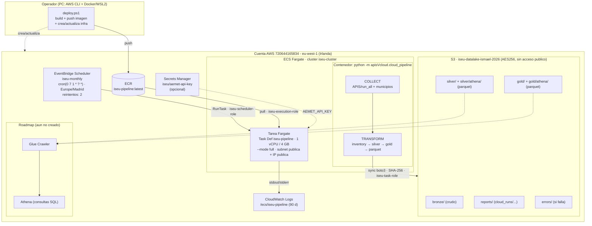

# ESTADO DEL DESPLIEGUE CLOUD — ISEU

> Documento de traspaso (handoff). Describe **lo que esta desplegado y funcionando** en AWS,
> como operarlo y como seguir mejorando. Actualizar este archivo cuando cambie la infra.
>
> Ultima actualizacion: **2026-06-27**.

## TL;DR

El pipeline ISEU se ejecuta **100% automatico, una vez al mes**, en AWS:

```
EventBridge Scheduler (dia 1, 07:00 Europe/Madrid)
        -> ECS Fargate RunTask (--mode full)   [imagen en ECR]
        -> pipeline local (APIS -> bronze -> silver -> gold -> parquet)
        -> S3  (bronze/ silver/ gold/ reports/ errors/)
```

Todo se creo con un unico script: [deploy.ps1](deploy.ps1). Para borrarlo: [teardown.ps1](teardown.ps1).

## Arquitectura



<details>
<summary>Mismo diagrama en ASCII (para terminal / PDF)</summary>

```text
                         CUENTA AWS 720644165834 — region eu-west-1 (Irlanda)
  ┌──────────────────────────────────────────────────────────────────────────────────────┐
  │                                                                                        │
  │   ┌───────────────────────────┐         programa (cron mensual)                        │
  │   │  Amazon EventBridge        │  cron(0 7 1 * ? *)  TZ Europe/Madrid                   │
  │   │  Scheduler  "iseu-monthly" │  reintentos: 2                                         │
  │   └─────────────┬─────────────┘                                                        │
  │                 │ RunTask  (assume: iseu-scheduler-role)                                │
  │                 ▼                                                                       │
  │   ┌───────────────────────────────────────────────────────────────────────┐           │
  │   │  Amazon ECS  (cluster "iseu-cluster")                                   │           │
  │   │  ┌─────────────────────────────────────────────────────────────────┐   │           │
  │   │  │  Tarea Fargate  (Task Def "iseu-pipeline", 1 vCPU / 4 GB)        │   │           │
  │   │  │  comando: --mode full                                           │   │           │
  │   │  │  ┌──────────────────────────────────────────────────────────┐  │   │           │
  │   │  │  │ Contenedor (imagen ECR "iseu-pipeline:latest")           │  │   │           │
  │   │  │  │   python -m apisVcloud.cloud_pipeline                     │  │   │           │
  │   │  │  │                                                          │  │   │           │
  │   │  │  │   COLLECT            TRANSFORM                            │  │   │           │
  │   │  │  │   APIS/run_all  ─►  01_inventory ─► 02_silver ─►         │  │   │           │
  │   │  │  │   municipios/        03_gold ─► publish_cloud (parquet)  │  │   │           │
  │   │  │  └───────────┬───────────────────────────────┬─────────────┘  │   │           │
  │   │  │   roles:     │ taskRole=iseu-task-role        │ stdout/stderr   │   │           │
  │   │  │   execRole=iseu-execution-role (ECR pull)     │                 │   │           │
  │   │  └──────────────┼───────────────────────────────┼─────────────────┘   │           │
  │   │   Red: VPC vpc-07e0…  subnets publicas x3  SG default  IP publica ON   │           │
  │   └──────────────────┼───────────────────────────────┼───────────────────┘           │
  │                       │ sync (boto3, SHA-256)         │ logs                            │
  │                       ▼                               ▼                                 │
  │   ┌──────────────────────────────────┐   ┌──────────────────────────────┐             │
  │   │  Amazon S3  (data lake)          │   │  CloudWatch Logs             │             │
  │   │  iseu-datalake-ismael-2026       │   │  /ecs/iseu-pipeline (90 d)   │             │
  │   │   ├─ bronze/   (crudo)           │   └──────────────────────────────┘             │
  │   │   ├─ silver/   (limpio)          │                                                  │
  │   │   │    └─ athena/ (parquet)      │        ┌─────────────────────────────┐          │
  │   │   ├─ gold/     (indicadores)     │  ····► │  (ROADMAP) Glue Crawler ►    │          │
  │   │   │    └─ athena/ (parquet)      │        │  Athena (consultas SQL)     │          │
  │   │   ├─ reports/  (cloud_runs/...)  │        └─────────────────────────────┘          │
  │   │   └─ errors/   (si falla)        │                                                  │
  │   │  AES256 · acceso publico OFF     │                                                  │
  │   └──────────────────────────────────┘                                                  │
  │                                                                                        │
  │   (opcional) Secrets Manager "iseu/aemet-api-key" ──► AEMET_API_KEY en la tarea         │
  └──────────────────────────────────────────────────────────────────────────────────────┘

  Operador (PC con AWS CLI + Docker/WSL2):  deploy.ps1 ─► build imagen ─► push a ECR
                                            + crea/actualiza toda la infra de arriba
```

</details>

**Flujo resumido:** el Scheduler dispara mensualmente una tarea Fargate que ejecuta el
pipeline dentro del contenedor; cada fase sincroniza su capa a S3 por hash (sin duplicar) y
escribe logs en CloudWatch. Un informe por ejecucion queda en `reports/cloud_runs/` y, si
algo falla de forma irrecuperable, el detalle va a `errors/`. La consulta analitica
(Glue + Athena) sobre los Parquet de `*/athena/` es el siguiente paso del roadmap.

## Inventario de recursos AWS (en uso)

| Recurso | Identificador | Notas |
|---|---|---|
| Cuenta AWS | `720644165834` (usuario IAM `Ismael`) | |
| Region | `eu-west-1` (Irlanda) | |
| **Bucket S3 (data lake)** | `iseu-datalake-ismael-2026` | Cifrado AES256, acceso publico bloqueado. UNICO bucket oficial. |
| **Repositorio ECR** | `iseu-pipeline` (tag `latest`) | Imagen del contenedor. |
| **Cluster ECS** | `iseu-cluster` | Fargate. |
| **Task Definition** | `iseu-pipeline` (rev. `:1`) | 1 vCPU / 4 GB, comando `--mode full`. |
| **Log group** | `/ecs/iseu-pipeline` | Retencion 90 dias. |
| **Schedule** | `iseu-monthly` | `cron(0 7 1 * ? *)`, TZ `Europe/Madrid`, reintentos 2. |
| Task Role | `iseu-task-role` | Permisos S3 al data lake (lectura/escritura de las capas). |
| Execution Role | `iseu-execution-role` | `AmazonECSTaskExecutionRolePolicy` (ECR + logs). |
| Scheduler Role | `iseu-scheduler-role` | `ecs:RunTask` + `iam:PassRole`. |
| Red | VPC `vpc-07e021b389c44a7da` | subnets publicas: `subnet-0ddc59b039de59250`, `subnet-0a64bfddba9e0fa7e`, `subnet-039f9f740e3d8fd83`; SG `sg-0a2a0b4433556bd66`; IP publica ENABLED (sin NAT Gateway). |
| AEMET | (sin secret) | `AEMET_API_KEY` no configurada -> AEMET se omite. Ver "Activar AEMET". |

> Nota: existio un bucket vacio `lucas-tfm-datalake-720644165834` (solo carpetas de 0 bytes)
> que se **elimino** el 2026-06-27 por duplicar. El unico data lake valido es el de arriba.

## Verificacion / prueba realizada

Se lanzo una ejecucion manual (`aws ecs run-task ...`) el 2026-06-27. Resultado:
la fase de APIs subio **82 ficheros (~543 MB) a `bronze/`** y el informe a `reports/`,
confirmando el flujo end-to-end. La fase municipal sufre timeouts esporadicos en algunas
ciudades (reintenta 3 veces; con `ISEU_CONTINUE_ON_COLLECT_ERROR=true` continua igualmente).

## Runbook (operaciones habituales)

Requisitos en la maquina del operador: **AWS CLI**, **Docker Desktop** (con WSL2), y
`aws configure` con credenciales de la cuenta. Comprobar con [check-prereqs.ps1](check-prereqs.ps1).

```powershell
# 0) Comprobar requisitos
./check-prereqs.ps1

# 1) (Re)desplegar TODO (idempotente). Reconstruye/sube imagen y reconcilia infra.
./deploy.ps1 -Bucket iseu-datalake-ismael-2026 -Region eu-west-1
#   con AEMET:  ... -AemetApiKey "TU_CLAVE"

# 2) Lanzar una ejecucion manual (sin esperar al cron)
aws ecs run-task --cluster iseu-cluster --launch-type FARGATE `
  --task-definition iseu-pipeline --region eu-west-1 `
  --network-configuration "awsvpcConfiguration={subnets=[subnet-0ddc59b039de59250,subnet-0a64bfddba9e0fa7e,subnet-039f9f740e3d8fd83],securityGroups=[sg-0a2a0b4433556bd66],assignPublicIp=ENABLED}"

# 3) Ver logs en vivo
aws logs tail /ecs/iseu-pipeline --follow --region eu-west-1

# 4) Ver datos en el lake
aws s3 ls s3://iseu-datalake-ismael-2026/ --recursive --summarize --human-readable

# 5) Cambiar la frecuencia (ejemplo: dia 15 a las 03:00)
./deploy.ps1 -Bucket iseu-datalake-ismael-2026 -ScheduleCron "cron(0 3 15 * ? *)"

# 6) Borrar todo (conserva bucket) / borrar tambien datos
./teardown.ps1 -Bucket iseu-datalake-ismael-2026
./teardown.ps1 -Bucket iseu-datalake-ismael-2026 -DeleteBucket
```

### Activar AEMET (opcional)
1. Conseguir API key en https://opendata.aemet.es/centrodedescargas/altaUsuario
2. Re-desplegar con `-AemetApiKey "..."`. El script crea el secret en Secrets Manager
   (`iseu/aemet-api-key`), da permiso de lectura al Execution Role e inyecta `AEMET_API_KEY`.

## Modos de ejecucion (variable ISEU_MODE / --mode)

- `collect`   -> ejecuta las APIs y sube `bronze/`.
- `transform` -> descarga `bronze/`, genera `silver/` y `gold/`, publica Parquet.
- `full`      -> ambas fases en la misma tarea (lo que usa el schedule).

Ver todas las variables `ISEU_*` en [../README.md](../README.md) (tabla de entorno).

## Decisiones de diseno (por que es asi)

- **Docker + Fargate** y no Lambda: el pipeline usa pandas/pyarrow y descargas pesadas; no
  cabe en los limites de Lambda. Fargate es serverless y solo factura por ejecucion.
- **Subnet publica con IP publica, sin NAT Gateway**: evita el coste fijo de un NAT para una
  tarea mensual. El contenedor no expone puertos.
- **Sync por hash SHA-256**: reejecutar el mismo mes no duplica objetos.
- **Gold en un unico Parquet** de momento (volumen pequeno). Particionar por `year/month`
  cuando crezca (evitar el problema de muchos Parquet diminutos).

## Problemas ya resueltos (para no repetirlos)

El `deploy.ps1` tuvo 3 bugs corregidos; si reescribes el script, ojo con esto en PowerShell:
1. **JSON inline a `aws`**: PowerShell elimina las comillas dobles -> pasar JSON con
   `--xxx "file://archivo.json"` (generado con `ConvertTo-Json`), nunca inline.
2. **Login ECR**: `... | docker login --password-stdin` da `400 Bad Request` con el
   credsStore `desktop`. Usar `docker login --username AWS --password $pw $ecrUri`.
3. **Deteccion de existencia / errores**: en PowerShell 5.1 un exit code != 0 de un
   ejecutable nativo NO lanza excepcion. Comprobar `$LASTEXITCODE`, no `try/catch`.

## Roadmap (por donde seguir mejorando)

Prioridad alta:
1. **Glue Crawler + Athena**: crawler sobre `s3://iseu-datalake-ismael-2026/silver/athena/`
   y `gold/athena/`. La fase `publish_parquet` ya genera el Parquet; falta catalogar y
   consultar. (Hoy `silver/`/`gold/` se ven tras una ejecucion `full` o `transform`.)
2. **Step Functions**: separar `collect` y `transform` en estados distintos para reintentar
   solo la fase que falla (la municipal es la fragil).
3. **DLQ del Scheduler**: anadir una cola SQS como dead-letter para invocaciones no
   entregadas (recomendado en el README; aun no creada).

Prioridad media:
4. **Robustez municipal**: subir reintentos / timeouts en `APIS/municipios/`, o usar
   `ISEU_SKIP_MUNICIPAL_RESOURCES=true` / `ISEU_MUNICIPAL_MAX_RESOURCES` para acotar.
5. **Particionado de Gold** por `year`/`month` cuando supere varios GB.
6. **Alarma CloudWatch** sobre `errors/` o sobre fallos de la tarea (notificacion email/SNS).
7. **Versionado del bucket** + reglas de ciclo de vida (transicion a S3-IA/Glacier).

Prioridad baja / TFM:
8. **SageMaker** para inferencia del modelo (`model/`): es el componente caro; crear el
   endpoint solo para demos y automatizar su borrado.
9. **CI**: build+push de la imagen con GitHub Actions / CodeBuild (evita depender de Docker
   local en cada operador).

## Seguridad — PENDIENTE IMPORTANTE

Durante el despliegue se compartio una Access Key en texto. **Rotarla**: IAM -> usuario
`Ismael` -> Security credentials -> crear nueva access key, actualizar `aws configure`,
y borrar la antigua. No commitear nunca claves en el repo.

## Ficheros de esta carpeta

| Archivo | Para que |
|---|---|
| [deploy.ps1](deploy.ps1) | Crea/actualiza toda la infra (idempotente). |
| [teardown.ps1](teardown.ps1) | Borra la infra (`-DeleteBucket` borra tambien datos). |
| [check-prereqs.ps1](check-prereqs.ps1) | Verifica AWS CLI, credenciales, Docker, WSL2. |
| [README.md](README.md) | Guia de despliegue paso a paso para humanos. |
| [ESTADO.md](ESTADO.md) | Este documento (estado vivo + runbook + roadmap). |
